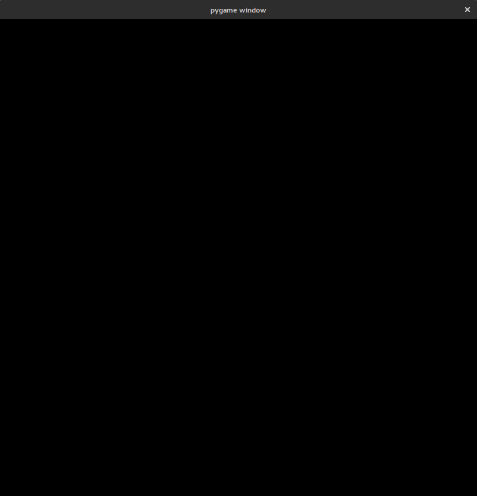
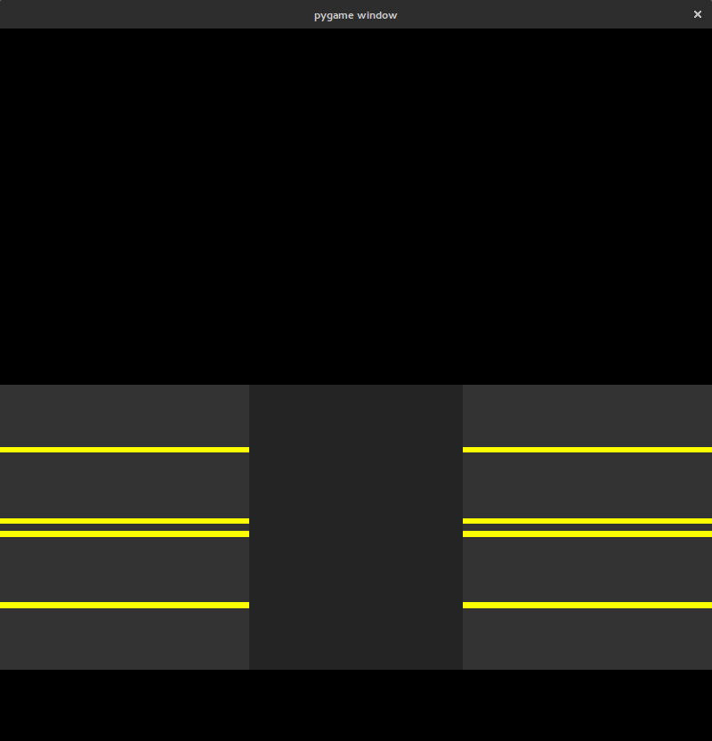
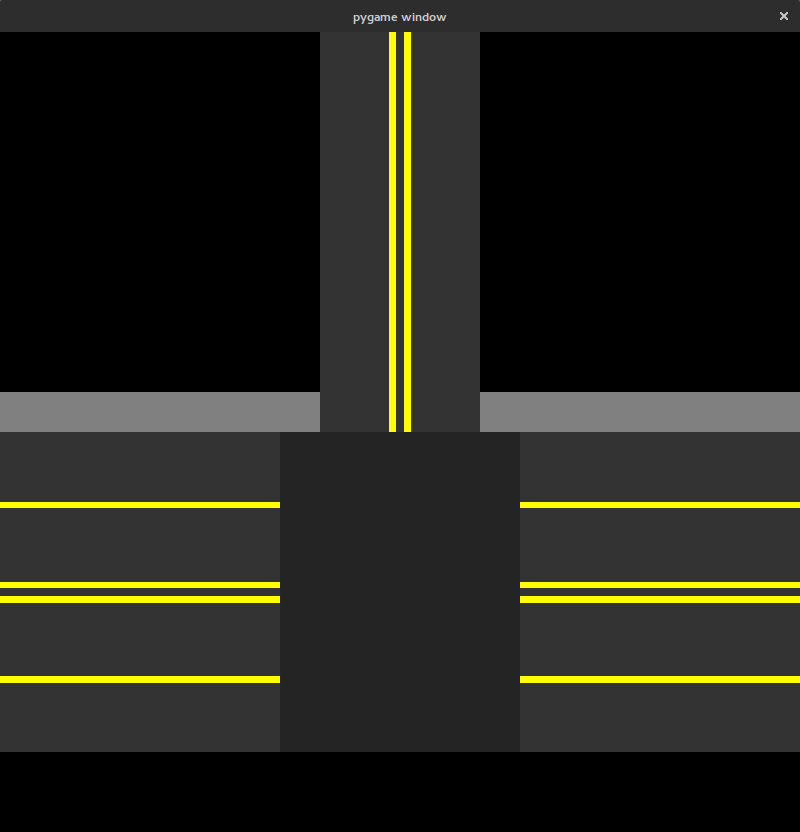
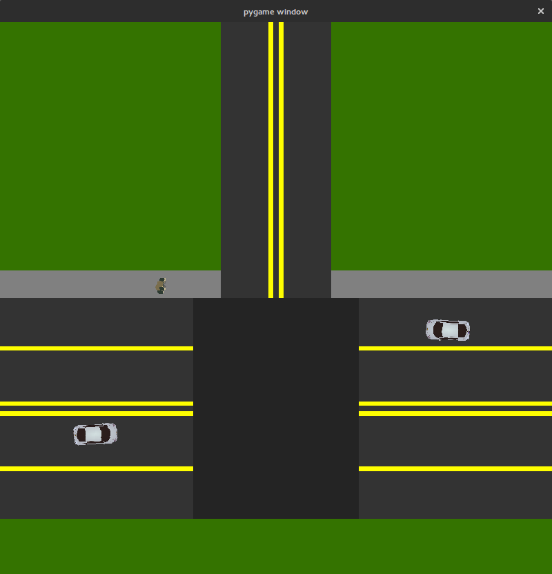

Examples
=========

Setup and KeyboardAgent Tutorial
^^^^^^^^^^^^^^^^^^^^^^^^^^^^^^^^
This introduction will guide you through running a simple example on the simulator with a car that can be controlled through the Keyboard. 

::

   import gym
   import gym_urbandriving as uds
   from gym_urbandriving.agents import KeyboardAgent, NullAgent
   from gym_urbandriving.state import SimpleIntersectionState
   from gym_urbandriving.assets import Car, Pedestrian
   from gym_urbandriving import UrbanDrivingEnv

   vis = uds.PyGameVisualizer((800, 800))
   init_state = SimpleIntersectionState(ncars=3, nped=2)
   env = UrbanDrivingEnv(init_state=init_state,
                         visualizer=vis,
                         max_time=500,
                         randomize=True,
                         agent_mappings={Car:NullAgent,
                                         Pedestrian:NullAgent}
                         )

   env._render()

First we create a visualizer window of size 800x800. We use PyGame for visualization.

The ``SimpleIntersectionState`` defines a simple four-way intersection. We instantiate
our initial state with 3 cars and 2 pedestrians.

The ``UrbanDrivingEnv`` handles running the simulation and collecting agent actions.
We instantiate it with our initial state and visualizer. ``max_time=500`` tells the
environment to reset after 500 ticks if no crashes occur. ``randomize=True`` makes the
environment call the ``randomize`` function in the ``SimpleIntersectionState``, making the
``SimpleIntersectionState`` reset itself to a random arrangement of 3 cars and 2
pedestrians. We use ``agent_mappings`` to specify what types of agents control background
objects. In this case, we use ``NullAgents``, which take no action.

Next we setup the control and simulation loop

::

   state = init_state
   agent = KeyboardAgent(agent_num=0)
   while (True):
      action = agent.eval_policy(state)
      state, reward, done, info_dict = env._step(action)
      env._render()

      if done:
         env._reset()
         state = env.get_state_copy()

We choose a ``KeyboardAgent`` to control the main car in the scene. Its ``agent_num``
specifies the index of the object it is controlling in the scene. For any agent, calling
``agent.eval_policy(state)`` returns the action the agent would take assuming it was the 
object at index ``agent_num`` of the states list of objects. ``env._step()`` applies the action to the ``0th`` controllable object
in the scene. For every other object, it queries its internal list of agents as specified in
``agent_mappings``. Once every action is collected, ``env_.step`` advances the state and returns.

:download:`Download <../../examples/setup_tutorial.py>`

State Design Tutorial
^^^^^^^^^^^^^^^^^^^^^
Designing a state is very simple in UDS. To design a custom state, simply inherit from ``PositionState``, implement your own array of ``static_objects`` and define your own ``randomize()`` function.

First, create a custom state class that inherits from ``PositionState``. Let's also set up the render cycle. 

::

   import random
   import gym_urbandriving as uds
   from gym_urbandriving.state import PositionState
   from gym_urbandriving.agents import NullAgent
   from gym_urbandriving.assets import Car, Terrain, Street, Lane, Sidewalk

   class CustomState(PositionState):
      static_objects = []

   vis = uds.PyGameVisualizer((800, 800))
   init_state = CustomState()
   env = uds.UrbanDrivingEnv(init_state=init_state,
                             visualizer=vis,
                             randomize=True)

   while(True):
      env._render()

Now, running this script should generate a blank screen. 

Lets add the streets to our state now. Streets are composed of ``Lane`` and ``Street`` objects. ``Lane`` objects are associated with directionality, so use these to construct the two sides of a road. ``Street`` objects should be used at intersections, where cars can travel in any direction. Lets build a three-way intersection between a four lane road and a two lane road. Place down the four lane road first. For rectangular objects, the arguments are the coordinates of the centroid, the height and width of the object, and then any rotation around the centroid. Edit the ``CustomState`` class to look like the following.

::

   class CustomState(PositionState):
      static_objects = [Lane(175, 550, 350, 100, angle=-180),
                        Lane(175, 650, 350, 100, angle=-180),
                        Lane(175, 750, 350, 100),
                        Lane(175, 850, 350, 100),
                        Lane(825, 550, 350, 100, angle=-180),
                        Lane(825, 650, 350, 100, angle=-180),
                        Lane(825, 750, 350, 100),
                        Lane(825, 850, 350, 100),
                        Street(500, 700, 300, 400),]

Notice how the angle of the lanes is manipulated so the road has proper directionality. Next, let's add the third road and some sidewalks. Sidewalks have no directionality, so we can just place them down directly.

::

   class CustomState(PositionState):
      static_objects = [Lane(175, 550, 350, 100, angle=-180),
                        Lane(175, 650, 350, 100, angle=-180),
                        Lane(175, 750, 350, 100),
                        Lane(175, 850, 350, 100),
                        Lane(825, 550, 350, 100, angle=-180),
                        Lane(825, 650, 350, 100, angle=-180),
                        Lane(825, 750, 350, 100),
                        Lane(825, 850, 350, 100),
                        Street(500, 700, 300, 400),
                        Lane(450, 250, 500, 100, angle=-90),
                        Lane(550, 250, 500, 100, angle=90),
                        Sidewalk(200, 475, 400, 50),
                        Sidewalk(800, 475, 400, 50)]

We are almost done. All thats left is to fill in the empty blocks with ``Terrain`` objects and write our own ``randomize`` function. The easiest way is to use the ``Lane`` objects' builtin ``generate_car`` and the ``Sidewalk`` objects' built-in ``generate_man`` functions. These ``generate`` functions try to the position the actors facing the ``angle`` of the object. When generating objects, you should check if they collide with other randomly generated objects

::

  class CustomState(PositionState):
      static_objects = [Lane(175, 550, 350, 100, angle=-180),
                        Lane(175, 650, 350, 100, angle=-180),
                        Lane(175, 750, 350, 100),
                        Lane(175, 850, 350, 100),
                        Lane(825, 550, 350, 100, angle=-180),
                        Lane(825, 650, 350, 100, angle=-180),
                        Lane(825, 750, 350, 100),
                        Lane(825, 850, 350, 100),
                        Street(500, 700, 300, 400),
                        Lane(450, 250, 500, 100, angle=-90),
                        Lane(550, 250, 500, 100, angle=90),
                        Sidewalk(200, 475, 400, 50),
                        Sidewalk(800, 475, 400, 50,angle=-180),
                        Terrain([(0, 0), (400, 0), (400, 450), (0, 450)]),
                        Terrain([(600, 0), (1000, 0), (1000, 450), (600, 450)]),
                        Terrain([(0, 900), (1000, 900), (1000, 1000), (0, 1000)]),
                        ]

      def randomize(self):
            self.dynamic_objects = []
            lane_objs = [obj for obj in self.static_objects if type(obj) == Lane]
            sidewalk_objs = [obj for obj in self.static_objects if type(obj) == Sidewalk]

            for i in range(3):
              car = random.choice(lane_objs).generate_car()
              if not any([car.collides(obj) for obj in self.static_objects + self.dynamic_objects]):
                  self.dynamic_objects.append(car)
            for i in range(2):
              man = random.choice(sidewalk_objs).generate_man()
              if not any([man.collides(obj) for obj in self.static_objects + self.dynamic_objects]):
                  self.dynamic_objects.append(man)

Now, you should see the following image (or something similar) when running this script.

:download:`Download <../../examples/state_design_tutorial.py>`

Changing the Background Agent
^^^^^^^^^^^^^^^^^^

Finally, we will walk through changing the Background Agent and how agents in general should interact with the environment for the simulator to work properly. 
Let us first look at the basics needed for any Agent which is best outlined in our ``NullAgent``. 

::

  class NullAgent:
      """
      Agent which does nothing
      """
      def __init__(self, agent_num=0):
          return
      def eval_policy(self, state):
          """
          Returns None to simulate uncontrolled object
          """
          return None

Every agent should support initialization with an ``agent_num``. This is so that it knows which object it is supposed to plan for and control. This leads us to the other required function ``eval_policy``, which takes in a state and returns the proper action. 

Agents that do nothing are not very interesting, so we have provided a simple agent to better illustrate using our API, the ``AccelAgent``, that tries to move forward and stops as soon as it detects a collision some number of steps out. **Note: Accel agents are simple and unoptimized so expect them to be slower and act suboptimally**. In our ``AccelAgent`` we made changes to both the initializer and ``eval_policy``. 

::

  class AccelAgent:
    """
    Simple greedy search agent. Chooses action which maximizes expected time
    to next collision. 
    """

    def __init__(self, agent_num=0):
        self.agent_num = agent_num
        self.valid_actions = [(0, 1), (3, .5), (-3, .5), (0, -1)]
        self.quantum = 4
        return

    def eval_policy(self, state, nsteps=8):
        best_action = None
        best_time = 0
        best_angle_offset = 90

        for action in self.valid_actions:
            state_copy = deepcopy(state)
            time = 0

            for i, dobj in enumerate(state_copy.dynamic_objects):
                if i != self.agent_num:
                    dobj.step((0, 0))
                else:
                    dobj.step(action)

            angle_offset = abs((state_copy.dynamic_objects[self.agent_num].angle-45)%90-45)

            for z in range(nsteps//self.quantum):
                for y in range(self.quantum):
                    for i, dobj in enumerate(state_copy.dynamic_objects):
                        if i != self.agent_num:
                            dobj.step((0, 0))
                        else:
                            dobj.step(action)

                time += 1
                if (state_copy.collides_any(self.agent_num)):
                    break

            if time > best_time or (time == best_time and angle_offset < best_angle_offset):
                best_action = action
                best_time = time
                best_angle_offset = angle_offset
  
        return best_action

To put everything together, we first must set up the state as we did in the Setup and Keyboard Agent section, but this time we will and set our agent mappings to ``AccelAgent``. We will also use the ``use_ray`` flag turn `Ray`_ on, which will parallelize the planning of each agent for better performance. 

::

  vis = uds.PyGameVisualizer((800, 800))
  init_state = SimpleIntersectionState(ncars=3, nped=2)
  env = UrbanDrivingEnv(init_state=init_state,
                        visualizer=vis,
                        max_time=500,
                        randomize=True,
                        agent_mappings={Car:AccelAgent, 
                                        Pedestrian:AccelAgent},
                        use_ray=True
                        )
  state = init_state
  env._render()

We can then add our ``KeyboardAgent`` to control the main car in the scene, and the rest of the control and simulation loop is the same. 

::

  agent = KeyboardAgent(agent_num=0)
  while (True):
     action = agent.eval_policy(state)
     state, reward, done, info_dict = env._step(action)
     env._render()

     if done:
        env._reset()
        state = env.get_state_copy()

See all of this action here:
:download:`Download <../../examples/changing_background_agent_tutorial.py>`

.. _`Ray`: http://ray.readthedocs.io/en/latest/
