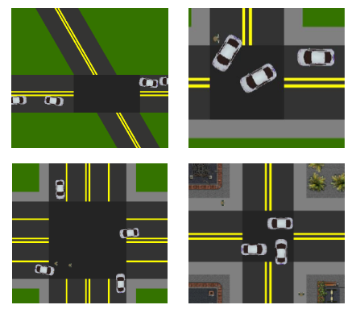

Urban Driving Simulator Documentation
===================================================

Introduction
^^^^^^^^^^^^
This is Berkeley AUTOLAB's Urban Driving Simulator. 

.. toctree::
   :maxdepth: 2
   :caption: Contents:

   examples.rst
   environment.rst
   state.rst
   objects.rst
   
   
Installation
^^^^^^^^^^^^
::
   
   git clone https://github.com/jerryz123/gym-urbandriving.git
   cd gym-urbandriving
   pip3 install -e .

These commands install gym-urbandriving and its requirements in the current Python environment.
