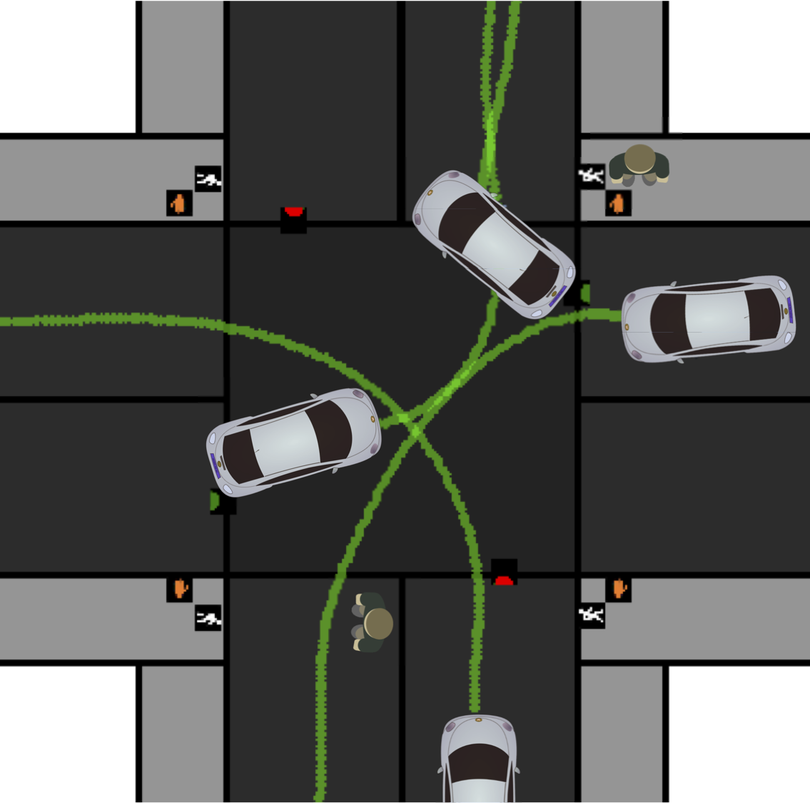

FLUIDS Documentation
===================================================

FLUIDS - a First-Order Local Urban Intersection Driving Simulator. :download:`Read our paper <CASE18_0350_MS.pdf>`

.. toctree::
   :maxdepth: 2
   :caption: Contents:

   why_fluids.rst
   installation.rst
   examples.rst
   environment.rst
   agents.rst
   state.rst
   actions.rst
   observations.rst
   objects.rst
   
   
