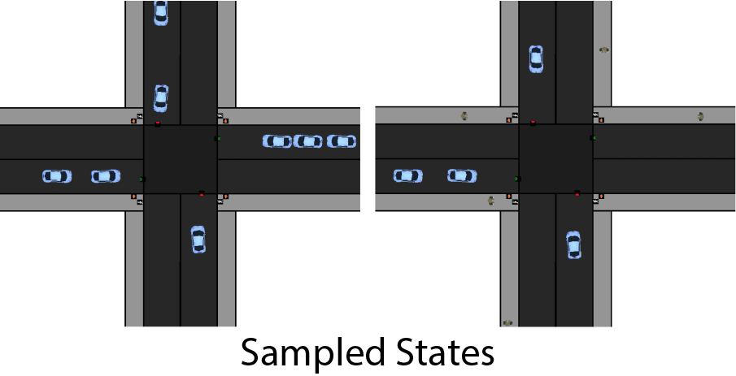
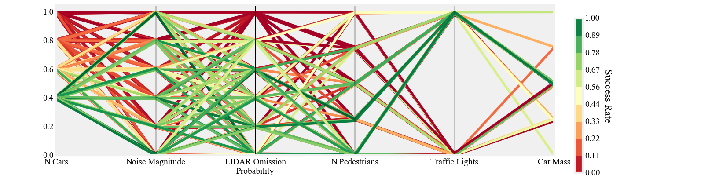
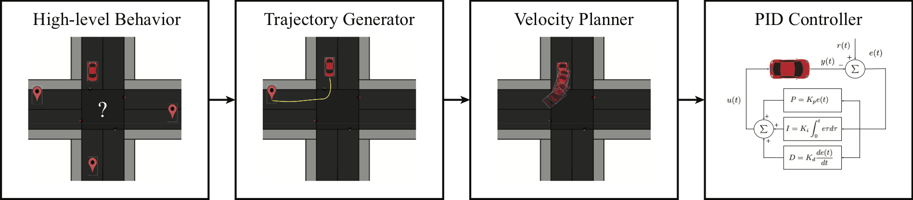

Why FLUIDS?
=============
To study and compare Reinforcement and Imitation Learning algorithms, the most commonly used benchmarks are OpenAI Gym, Mujoco, and ATARI games. However, these benchmarks generally fail to capture real-life challenges to learning algorithms, including multi-agent interactions, noisy sensors, and generalization. FLUIDS aims to fill this gap by providing a fast, birds-eye simulation of cars and pedestrians in an urban driving setting. Below, we highlight several notable capabilities of FLUIDS.

.. When car drives through an intersection it requires determining both the controls necessary to reach a goal state, but also predicting how other drivers will respond based solely on noisy sensor observations. The challenges of this task make it an interesting benchmark for Reinforcement and Imitation learning algorithms because it requires continuous actions, multi-agent planning and hierarchical behaviors. FLUIDS seeks to capture these challenges in a light weight simulator, which allows for easy prototyping and benchmarking new algorithms. 

Tests Generalization
^^^^^^^^^^^^^^^^^^^^^^^
FLUIDS is designed to test how well agents generalize to new environments that are both in and out of sample from the initial state distribution. The initial state distribution can be specified to be a range of cars on the road starting at various lane positions. The randomness stems from the number of cars currently on the road and the location of each car. 

To test how robust a policy is to out of sample distributions, FLUIDS allows for perturbations such as enabling pedestrians, varying traffic light timing and changing the amount of noise in the sensor readings. FLUIDS can convey how robust a policy is via the generation of a coordinate axis plot as shown below, which demonstrates which helps shows what disturbances significantly affect policy performance. 

Hierarchal Learning
^^^^^^^^^^^^^^^^^^^^

Self-driving cars commonly use a hierarchical planning stack to accomplish tasks, thus they make for a great benchmark to test recent advances in learning hierarchal structure. As shown below each background agent in has a planning stack broken into four levels; behavior logic, nominal trajectory generation, velocity planning and low-level PID. The details of how these components can be composed in a planning stack can be found in the FLUIDS white paper. 

When a tested agent acts in the simulator it can operate at the trajectory, velcoity or steering level of control. Thus the whole hierarchy can be learned or only sub-components. To specify which level of control to apply, the action space in the JSON config file can be changed to the designated level. 

::

   "agents":{
        ...
        "action_space":"steering", #other options:"trajectory", "velocity"
        ...}
    },

Multi-Agent Planning
^^^^^^^^^^^^^^^^^^^^^
Another advantage of FLUIDS is that the number of supervisors that can be controlled by an agent and that controlled by the simulator is variable. Experiments such as coordinating a fleet of self-driving cars traversing an intersection or having a single self-driving car pass an intersection can all be supported by simply changing the JSON config file. 

::

   "agents":{
        "controlled_cars":1,
        "background_cars":3,
        ...}
    },

Built-in Supervisors
^^^^^^^^^^^^^^^^^^^^^
In order to collect consist training data for Imitation Learning experiments and a baseline for performance. FLUIDS provides access to an array of supervisors, which can perform the driving tasks by having access to the global state of the world. The algorithms for the supervisors are the same planning stack used for the background agents. 

FLUIDS supports a supervisor for each level of the hierarchy. Thus, supervision can be used to potentially help discover the hierarchy or to only learn sub-components. FLUIDS also allows for human supervision via the use of a keyboard interface.

::

   #Hierarchy Supervisors

   #Provides Examples at the TrajectoryLevel of the Planner
   sup_traj = TrajectorySupervisor(agent_num=0)

   #Provides Examples at the Veloicty Level of the Planner
   sup_vel = VelocitySupervisor(agent_num=1)

   #Provides Examples at the Steering Level of the Planner
   sup_steer = SteeringSupervisor(agent_num=2)

   #Human Supervisor

   #Uses keyboard to get signal 

   sup_human = KeyBoardAgent

See the Examples section for a tutorial on how to use the supervisor agents. 
